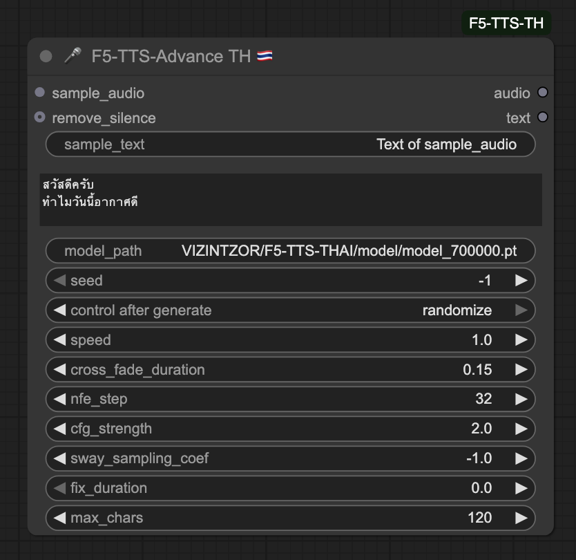

# 🛠️ ComfyUI-F5-TTS-TH 🇹🇭  
**Custom Node สำหรับแปลงข้อความเป็นเสียงภาษาไทย บน ComfyUI**  

---
### Update
### Muti-Speaker - (28th-May-2025)
 <br>
ใช้ [ชื่อตัวละคร] กำหนด tag ใช้ตัวละครใน prompt และ ส่วนใน Char_name_i ไม่ต้องมี [ ]<br>

### วิธีการ ดาวโหลด โมเดล
ให้ไปที่ https://huggingface.co/VIZINTZOR/F5-TTS-THAI/tree/main หรือ https://huggingface.co/VIZINTZOR/F5-TTS-THAI/tree/main/model



สำหรับ 🎤 F5-TTS-Advance TH 🇹🇭 node นี้ ให้ 
ใส่ VIZINTZOR/F5-TTS-THAI/model/model_650000.pt ในช่อง Model name

กรณีไม่ดาวโหลดโมเดล ให้เราใช้ wget ดาวโหลด ไว้ในนี้ <br>
```
cd /workspace/ComfyUI/custom_nodes/ComfyUI-F5-TTS-TH/submodules/F5TTS-on-Pod/model/<br>
```

ตัวอย่าง นิทาน<br>
```
กลีบดาวพาทั้งสองไปยังทุ่งกว้าง ที่มีดอกไม้พูดได้มากมาย
และเล่าเรื่องราวของโลกเวทมนตร์ให้ฟัง

โลกนี้จะเปิดทางให้เฉพาะผู้กล้าที่มีความเมตตาและความอยากรู้อย่างแท้จริง

[องุ่น] ยิ้มกว้าง "งั้นฉันผ่านแน่ เพราะฉันกล้า!"

[มะนาว] "แล้วฉันล่ะ...ฉันมีหัวใจที่อยากรู้จักทุกชีวิตในป่านี้เลยนะ"
```

# 🚧 **Underconstruction — IN PROGRESS!** 🚧  
_เสียงไทยที่เท่จนต้องเบิ้ลหูฟัง_  <br>
✅ ทดสอบผ่าน การ์ดrtx 30xxx, 40xx support Python 3.10 Cuda 11.8 - 12.6<br>
❌ rtx 50xx nightly version ยังไม่ support<br>
⁉️การ์ด v100, A100 ของ runpod บางทีก็ได้ บางทีไม่ได้ แอบงงอยู่  <br>
<br>
**28-05-2025** เพิ่ม โมลเดลใหม่ 6500000.pt ,update อ่านภาษาอังกฤษ ให้เป็นภาษา คาราโอเคะ <br>
**10-05-2025** เพิ่ม โมลเดลใหม่ 6000000.pt, add requirements.txt fix error <br>
**14-05-2025** -Fix bug windows cannot delete tmp, update new model list <br>

## 🎤 เกี่ยวกับโปรเจกต์นี้

`ComfyUI-F5-TTS-TH` คือ Node เสริมสำหรับ [ComfyUI](https://github.com/comfyanonymous/ComfyUI)  
ที่เปิดโอกาสให้คุณสามารถแปลงข้อความเป็นเสียง **ภาษาไทย** ได้แบบง่าย ๆ  
รองรับเสียงอ้างอิง + ปรับแต่งข้อความได้เอง — เพื่อการสร้างเสียงที่เป็นเอกลักษณ์ของคุณเอง 🎧

🧠 พลังมาจากโมเดลภาษาไทย:  
- 🧬 [F5-TTS (Original Repo)](https://github.com/SWivid/F5-TTS)  
- 🇹🇭 [F5-TTS-THAI (Thai Model)](https://github.com/VYNCX/F5-TTS-THAI)  
- 🤗 [Model on HuggingFace](https://huggingface.co/VIZINTZOR/F5-TTS-THAI)  

🔁 พัฒนาต่อยอดมาจาก:  
- 💡 [niknah/ComfyUI-F5-TTS](https://github.com/niknah/ComfyUI-F5-TTS) – **ขอบคุณสำหรับโครงสร้างและแรงบันดาลใจ!**

---
# 🎤 ComfyUI-F5-TTS-TH 🇹🇭

โมดูล Custom Node สำหรับ ComfyUI ที่ให้คุณสามารถใช้โมเดล F5-TTS-THAI ทำ Text-to-Speech (TTS) ภาษาไทย ได้โดยตรง 🎶  
ใช้โมเดลจาก [F5-TTS-THAI (VYNCX)](https://github.com/VYNCX/F5-TTS-THAI) ซึ่งถูกฝึกมาสำหรับเสียงภาษาไทยโดยเฉพาะ  

## 🚀 วิธีติดตั้ง

### 1. Clone Node
```bash
cd ComfyUI/custom_nodes/
git clone https://github.com/gordon123/ComfyUI-F5-TTS-TH.git
```

ถ้าใคร Install [ComfyUI](https://github.com/gordon123/lean2ComfyUI/blob/main/(Thai)%20%23EP7.%20Install%20witn%20command%20line.md) ด้วย command line ตามนี้

### 🔧 2. Clone repository และติดตั้ง F5-TTS-THAI (แบบ submodule)

```
cd ComfyUI-F5-TTS-TH

git submodule update --init --recursive
```

### 3. สร้าง virtual env ถ้าทำแล้วข้ามไป
```
python -m venv venv

source venv/bin/activate
```

### 4. อัปเกรด pip
```
pip install --upgrade pip
```

### 5. ติดตั้ง dependencies 
Portable version Comfyui เรียก จาก python ใน folder embeded นะครับ ในการใช้ pip <br>
```
#FILE PATH#_embeded/python.exe -m pip install -r requirements.txt
```

อันนี้สำหรับคนลง CpmfyUI แบบ native version
```
pip install -r requirements.txt
```
## Core PyTorch + Audio backend เลือก ให้ตรงกับ Pod ที่ตัวเองใช้ ตัวไดตัวหนึ่ง

### 🔥 CUDA 12.6 (RTX 30/40 ซีรีส์ และ ComfyUI บน CUDA 12.6)
```
pip install torch torchvision torchaudio --extra-index-url https://download.pytorch.org/whl/cu126
```

### 🛠️ CUDA 11.8 (GPU รุ่นเก่า หรือถ้าคุณใช้ cu118)
```
pip install torch  torchaudio  --extra-index-url https://download.pytorch.org/whl/cu118
```
---
### 6. ติดตั้ง ffmpeg
ใครใช้ windows, ไปหาโหลดสำหรับ windows
คำสั่งนี้สำหรับ linux
```
apt update && apt install -y ffmpeg
```
สำหรับใครให้ดาวโหลด จาก hugginface เร็วขึ้นนิดหน่อย ให้ลง hf_xet
```
pip install hf_xet
```
### 7. Custom Node ที่แนะนำให้ติดตั้งเพิ่มเติม

| ชื่อ Node | ใช้ทำอะไร | ลิงก์ |
|-----------|------------|-------|
| **rgthree-comfy** | ระบบ UI Manager + ฟีเจอร์จัด Node เป็นกลุ่ม, ตัวเลือก dropdown, dynamic inputs | [github.com/rgthree/rgthree-comfy](https://github.com/rgthree/rgthree-comfy) |
| **ComfyUI Web Viewer** | ใช้ `VrchAudioSaverNode` สำหรับบันทึกเสียงพร้อม metadata ถูกต้อง ไม่เจอ codec error | [github.com/VrchStudio/comfyui-web-viewer](https://github.com/VrchStudio/comfyui-web-viewer) |

Upload audio เสียงของเรา 
https://huggingface.co/spaces/hf-audio/whisper-large-v3
แล้วกด transcribe เพื่อ copy ข้อความมาใช้
---
# F5TTS-Advance Parameters Guide

มาเจาะลึกทีละพารามิเตอร์กันดีกว่าว่าแต่ละตัวมัน “เวิร์ก” ยังไง แล้วถ้าเราเลื่อนค่าไปมาก–น้อย จะได้ผลลัพธ์แบบไหน 🌱

---
## `sample_audio`

- 📥 **เสียงอ้างอิง (reference audio)** ที่ส่งให้ระบบฟังโทนน้ำเสียง ทรวดทรงลมหายใจ  
- 🎯 ไม่มีค่า default เพราะเป็น input สำคัญที่สุด  
  - **แนะนำ**: ไฟล์ WAV mono, 24 kHz, PCM16, ความยาว 5–15 วินาที เสียงชัด ไม่มี noise  

---
## `sample_text`

- ✍️ **ข้อความตรงกับ `sample_audio`** ช่วยให้โมเดลจับคำสัณฐานเสียงได้แม่นยำ  อาจจะใช้ whisper ช่วย 
- 📝 default = `"Text of sample_audio"` แต่ถ้า mismatch คุณภาพเสียงจะดรอป  

---
## `text`

- 🎤 **ข้อความไทย** ที่ต้องการให้โมเดลสังเคราะห์  
- 🏷️ ตั้งเป็น multiline ได้ ยาวได้ตามใจ แต่ต้องไม่เกิน `max_chars`  ค่า default 250 char

---
## `model_name`

- 🗂️ เลือกรุ่นเช็คพอยต์ที่ฝึกมาแล้ว (เช่น `model_475000.pt` หรือ `model_500000.pt`)  
- ⚖️ รุ่นเลขสูงกว่า (เช่น 500 k vs 250 k) ผ่านการฝึกมากกว่า จับ nuances ดีขึ้น แต่ไฟล์ใหญ่ โหลดช้า  

---
## `seed`

- 🎲 ควบคุมความ **determinism** ของโมเดล  
- 🔀 `-1` = random ทุกครั้ง  
- 🔢 `>=0` (เช่น `42`) = ผลซ้ำได้ทุกครั้ง เหมาะกับการเทสต์  

---
## `speed`

- ⏩ อัตราเร็ว–ช้าในการพูด  
  - `1.0` = ปกติ  
  - `>1.0` = ช้าลง  
  - `<1.0` = เร็วขึ้น  
- 🚀 `2.0` ช้าลง 2× ฟังชัด แต่ลากเสียงยืด  
- 🐇 `0.3` เร็วขึ้น ฟังคล่องแต่บางทีอาจฟังยาก  

---
## `remove_silence`

- 🔇 ตัดช่วง **silence** หัว–ท้าย หรือเกินความจำเป็น  
  - `true`  = เสียงต่อเนียน ไม่มีเงียบสะดุด ตั้งไว้ใน code เป็น True เป็นค่า defult
  - `false` = เก็บช่วงเว้นวรรค เหมาะกับงาน pacing ต้นฉบับ  

---
## `cross_fade_duration`

- 🔄 ระยะเวลาที่ใช้ **cross-fade** ระหว่างเฟรมเสียง (วินาที)  
  - `0.0–0.1` = ต่อชิ้นสั้น ฟังเป็นชิ้นชัด  
  - `0.5–1.0` = ต่อเนียนนุ่ม แต่ถ้าเกินอาจจาง  

---
## `nfe_step`

- 🌀 จำนวน **steps** สำหรับ flow-matching  
  - สูง (e.g. max `64`) = คุณภาพดี แต่ช้า  
  - ต่ำ (e.g. min `16`)   = เร็ว แต่เสียงอาจแหบ/มี noise  

---
## `cfg_strength`

- 🎚️ “Classifier-free guidance” strength  
  - สูง max (≥ `4`)  = ตรงข้อความแน่น แต่ sacrifice ความหลากหลาย  
  - ต่ำ min (`1`) = ยืดหยุ่น เสียงสร้างสรรค์ แต่บางทีเบี่ยงเบนจาก prompt  

---
## `max_chars`

- 📜 จำกัดความยาว **ข้อความ** สูงสุดที่โมเดลยอมรับ  250 กำลังดี ไม่งั้น แรมจะหมด
- 🔢 ยิ่งสูง = ใส่ prompt ยาวขึ้น แต่ใช้เวลา/memory เพิ่ม  
- ⚠️ ถ้าล้นอาจตัดข้อความหรือเกิด error

# Error ที่เจอ บ่อยๆ

 <br><br>
เวลา install custom node ใหม่ เช็คดูว่า มี import failed ไหม แบบในตัวอย่าง และ เออเร่อ log มันจะแจ้ง ในวงกลม สีน้ำเงิน <br>
ในตัวอย่างนี้ คือเครื่องเรายังไม่ได้ลง package ```nltk```  วิธีแก้คือลง package ตามด้วยชื่อที่มันแจ้ง เช่น ```pip install nltk``` <br>


---
> “หยอดพารามิเตอร์ดั่งร่ายมนตร์  
> เสียงไทยจะไหลลื่น ใช่ดั่งฝัน”  

ปรับแต่ละค่าตามโจทย์งานของคุณ — narration, voice-over หรือ chatbot — แล้วลองฟังความเปลี่ยนแปลงดูนะครับ! 🚀

